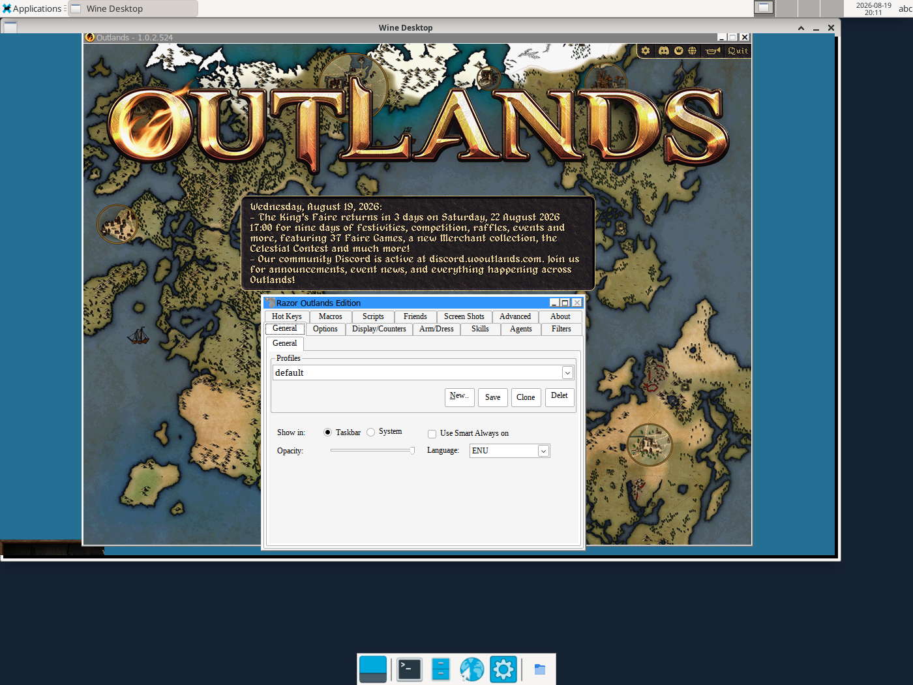

# uo_outlands_docker

**UO Outlands as a Docker container for Unraid.**

Runs the Windows client of [UO Outlands](https://uooutlands.com) as a Docker container,
controlled entirely in the browser - no VNC client needed. All mutable data lives under
`/config`. Startup logic comes from [Hezkore/uo-outlands-appimage](https://github.com/Hezkore/uo-outlands-appimage).



## Deploy

Pull and run the prebuilt image from GHCR:

```bash
docker compose up -d
```

Or via Unraid: copy `uo-outlands.xml` to `/boot/config/plugins/dockerMan/templates-user/`,
then Docker → *Add Container* → template `uo-outlands`.

Then open `http://<host-ip>:3010/`.

Edit `docker-compose.yml` (or the Unraid template) to set your `PASSWORD`, timezone and
`/config` path before starting.

### Notes

- Requires `security_opt: seccomp:unconfined` (32-bit Wine) and a large `shm_size` - already
  set in `docker-compose.yml`.
- Without a passed-through GPU, rendering falls back to software (llvmpipe). To use an
  Intel/AMD iGPU, keep the `/dev/dri` device and set `group_add` to your host's `video`/
  `render` group IDs (`stat -c '%g' /dev/dri/card0 /dev/dri/renderD128`).
- Full variable/setting reference, GPU passthrough and troubleshooting: see
  [docs/configuration.md](docs/configuration.md).

## License

This repository has no license set yet. The startup logic executed inside the image comes
from [Hezkore/uo-outlands-appimage](https://github.com/Hezkore/uo-outlands-appimage) under
its own license.

## Legal

Not affiliated with Ultima Online or UO Outlands. The game client is downloaded from the
official servers at runtime and is not distributed with the image.

## Contributors

- [layer0180](https://github.com/layer0180)
